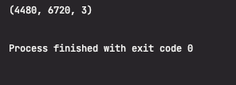
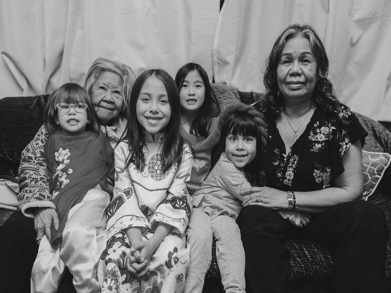
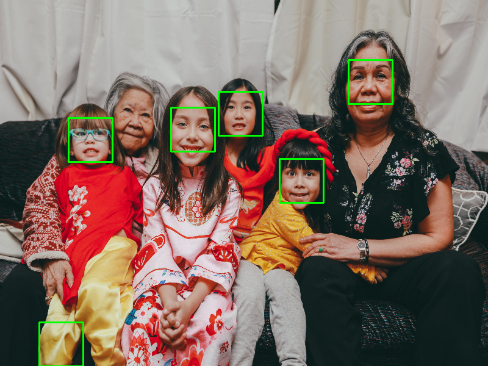
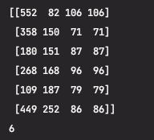
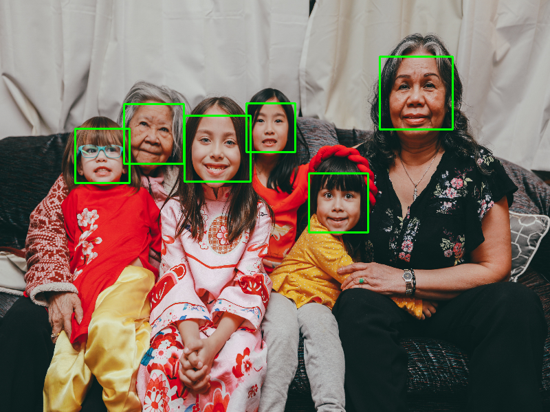

<center>

## Face Detection - haar cascades

</br>

harr cascade를 이용하여 얼굴을 감지해 보도록 하겠습니다.

데이터는 beautiful free image에서 한 장 가져왔습니다.


</center>

```python
import cv2

# load image
image = cv2.imread("./family.jpg")
print(image.shape)
```

<center>
먼저 cv2를 import 해줍니다.
그리고 이미지를 불러오고 사이즈를 확인해 보도록 하겠습니다.



사이즈는 4480, 6720으로 너무 크므로 조절하도록 하겠습니다.

</center>

```python
# resize
image = cv2.resize(image, (800, 600))
print(image.shape)
```

<center>
resize로 800, 600으로 조절해 준다음
흑백 이미지로 변경해 줄 것입니다.
</center>
</br>

```python
# convert RGB -> GRAY
img_gray = cv2.cvtColor(image, cv2.COLOR_BGR2GRAY)  # opencv RGB = BGR

cv2.imshow("people", img_gray)
cv2.waitKey(0)
```

</br>



<center>이제 harr cascade를 이용해서 face detection을 해보도록 하겠습니다.</center></br>

```python
face_detect = cv2.CascadeClassifier("./haarcascade_frontalface_default.xml")
detections = face_detect.detectMultiScale(img_gray, scaleFactor=1.1, minNeighbors=2)  # 배경에서 이미지를 찾아서 크고 작게 조절할 수있습니다. 감지 물체 주위의 후보 박스들 중에서 최적의 박스를 선택
print(detections)
print(len(detections))

for (x, y, w, h) in detections:
    print(x, y, w, h)
    cv2.rectangle(image, (x, y), (x + w, y + h), (0, 255, 0), 2)
cv2.imshow("people", image)
cv2.waitKey(0)

```

<center></br>

미리 학습되어 있는 harrcascade_frontalface_default.xml을 불러오겠습니다.</br>
detectMultiScale에는 인자 값들이 있는데.</br>
위 사진 같은 경우에 피사체들이 아주 잘 나와있으므로 감지하는데 무리가 없었지만 그렇지 않은 사진들 같은 </br>경우에 다른 부위에 감지되어 박스가 표시된 경우가 있었습니다.</br>
그것을 조절해 주기 위해 위의 인자값들을 사용해 주면 됩니다.</br>
예시 이미지로 인자값들을 일부러 크게 주어서 잘못 인식된 이미지를 보여드리겠습니다.</br>
아래 같은 detection결과를 가질 때,</br>
scaleFactor은 피사체마다 카메라의 거리에 따라 크고 작게 나올 수 있는데 그것을 배경에서 타깃을 찾아서 </br>크고 작게 조절해 줍니다.</br>
minNeighbors은 감지하는 물체의 주위에 감지되는 박스 중 최적의 박스를 찾아주는 기능입니다.</br>



변수 detections를 출력하면



각각의 좌표값이 나올 것입니다.

이 좌표들을 이용하여 rectangle을 표현해 주면 끝납니다.</br> 표현해 줄 때는 흑백 이미지가 아닌 사이즈를 줄인 원본이미지를 사용할 것이므로 image를 입력하였습니다.



결과가 예쁘게 잘 나온 것을 확인할 수 있습니다.

</center>
