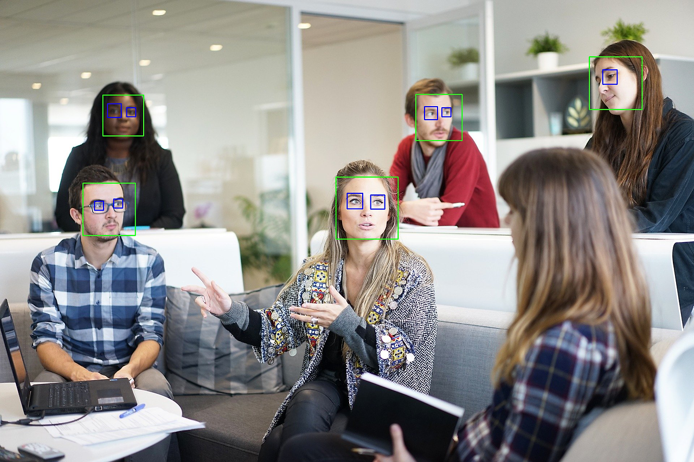

<center>

## Eye Detection - haar cascades

</br>

지난 글에 이어서 face detec와 함께 eye detect를 해보도록 하겠습니다.

</br>


<p align="center">
    <small >https://www.fenews.co.uk/skills/dealing-with-communication-challenges-within-the-project-team/
</small>
</p>

</br>
</center>

```python
import cv2

image = cv2.imread("./work.jpg")
print(image.shape)
# image = cv2.resize(image, (800, 600))
img_gray = cv2.cvtColor(image, cv2.COLOR_BGR2GRAY)

face_detector = cv2.CascadeClassifier("./haarcascade_frontalface_default.xml")
face_detection = face_detector.detectMultiScale(img_gray, scaleFactor=1.09, minNeighbors=10)
for (x, y, w, h) in face_detection:
    cv2.rectangle(image, (x, y), (x + w, y + h), (0, 255, 0), 2)

eye_detector = cv2.CascadeClassifier("./haarcascade_eye.xml")
eye_detection = eye_detector.detectMultiScale(img_gray, scaleFactor=1.09, minNeighbors=10, maxSize=(72, 72))
for (x, y, w, h) in eye_detection:
    print(w, h)
    cv2.rectangle(image, (x, y), (x + w, y + h), (255, 0, 0), 2)

cv2.imshow("work", image)
cv2.waitKey(0)
```

</br>
<center>

코드는 동일 하나 눈부분의 코드가 추가되었습니다.

eye detecor 부분 부터가 이번 내용의 추가 버전입니다. 이번 이미지의 경우 rectangle이 꽤나 많이 잡혀서 이미지를 줄이지 않고 그대로 사용하였습니다.

여러 이미지를 해본결과... 흑인분들의 데이터가 백인분들에 비해 많이 부족한지
scaleFactor, minNeighbors를 사용하였을때
흑인분들의 감지부분이 관계없는 부분의 감지부분보다
먼저 없어지는 경우가 많았습니다.

</br>



</br>
