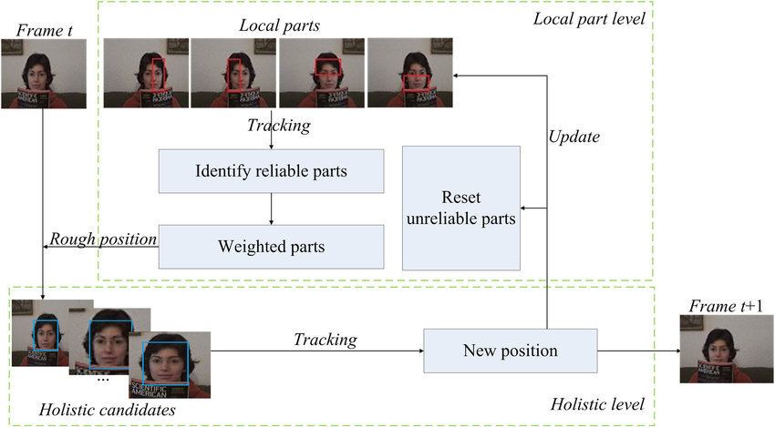

<small>https://www.researchgate.net/figure/The-overall-tracking-flowchart-of-the-KCF-HR-tracker_fig1_331187151</small>

 
KCF : Kernal Correlation Filters 
KCF에 대해 알아보겠습니다. 
 
위 이미지는 예시입니다. 
 

1. 첫 번째 프레임을 사용하여 트래킹 하려는 객체를 선택합니다.
   여기서는 사람 얼굴이 됩니다. 
   제일 얼굴과 근접한 프레임을 선택하여bounding box를 생성하여 트래킹을 합니다.

2. 그 다음 알고리즘은 particle filter라는 개념을 적용해서 두 번째 프레임에 더 큰 bounding box를 생성하게 됩니다. 
   얼굴 중앙 부분의 프레임을 조정하기 위해 계산을 한 후 3번째 프레임에서 업데이트가 됩니다.

3. 네번째 프레임과 다섯 번째 프레임에 새로운 bounding box로 얼굴의 중앙이 정렬됩니다.

4. 다시 처음 생성된 bounding box로 동일한 과정을 거칩니다.

5. 이 과정의 결과로 bounding box 중 가장 크기가 크게 나타났던 것이 줄어들게 되면서 객체에 맞게 조정되게 됩니다. 

객체를 감지할 수 있도록 bounding box에서 조정 과정을 통해서 객체에 맞게 조정하도록 합니다.
