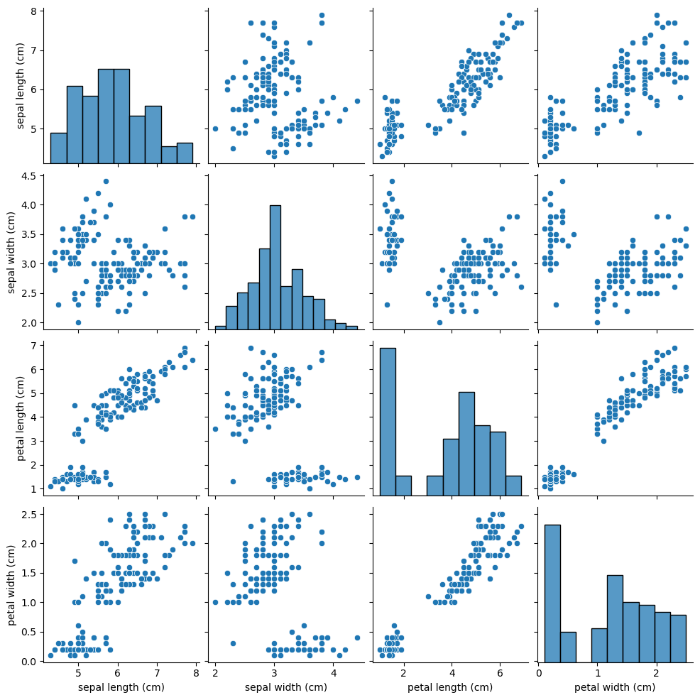

### Iris data

```python
import numpy as np
import pandas as pd

import matplotlib.pyplot as plt
from pandas.plotting import scatter_matrix
import seaborn as sns

from sklearn.model_selection import train_test_split
from sklearn.linear_model import LogisticRegression
from sklearn.metrics import accuracy_score
```

Data load -- iris

```python
from sklearn.datasets import load_iris
iris = load_iris()
```

### Data check decription

```python
print(iris.DESCR)
```

```python
.. _iris_dataset:

Iris plants dataset
--------------------

**Data Set Characteristics:**

    :Number of Instances: 150 (50 in each of three classes)
    :Number of Attributes: 4 numeric, predictive attributes and the class
    :Attribute Information:
        - sepal length in cm
        - sepal width in cm
        - petal length in cm
        - petal width in cm
        - class:
                - Iris-Setosa
                - Iris-Versicolour
                - Iris-Virginica

    :Summary Statistics:

    ============== ==== ==== ======= ===== ====================
                    Min  Max   Mean    SD   Class Correlation
    ============== ==== ==== ======= ===== ====================
    sepal length:   4.3  7.9   5.84   0.83    0.7826
    sepal width:    2.0  4.4   3.05   0.43   -0.4194
    petal length:   1.0  6.9   3.76   1.76    0.9490  (high!)
    petal width:    0.1  2.5   1.20   0.76    0.9565  (high!)
    ============== ==== ==== ======= ===== ====================

    :Missing Attribute Values: None
    :Class Distribution: 33.3% for each of 3 classes.
    :Creator: R.A. Fisher
    :Donor: Michael Marshall (MARSHALL%PLU@io.arc.nasa.gov)
    :Date: July, 1988

The famous Iris database, first used by Sir R.A. Fisher. The dataset is taken
from Fisher's paper. Note that it's the same as in R, but not as in the UCI
Machine Learning Repository, which has two wrong data points.

This is perhaps the best known database to be found in the
pattern recognition literature.  Fisher's paper is a classic in the field and
is referenced frequently to this day.  (See Duda & Hart, for example.)  The
data set contains 3 classes of 50 instances each, where each class refers to a
type of iris plant.  One class is linearly separable from the other 2; the
latter are NOT linearly separable from each other.

.. topic:: References

   - Fisher, R.A. "The use of multiple measurements in taxonomic problems"
     Annual Eugenics, 7, Part II, 179-188 (1936); also in "Contributions to
     Mathematical Statistics" (John Wiley, NY, 1950).
   - Duda, R.O., & Hart, P.E. (1973) Pattern Classification and Scene Analysis.
     (Q327.D83) John Wiley & Sons.  ISBN 0-471-22361-1.  See page 218.
   - Dasarathy, B.V. (1980) "Nosing Around the Neighborhood: A New System
     Structure and Classification Rule for Recognition in Partially Exposed
     Environments".  IEEE Transactions on Pattern Analysis and Machine
     Intelligence, Vol. PAMI-2, No. 1, 67-71.
   - Gates, G.W. (1972) "The Reduced Nearest Neighbor Rule".  IEEE Transactions
     on Information Theory, May 1972, 431-433.
   - See also: 1988 MLC Proceedings, 54-64.  Cheeseman et al"s AUTOCLASS II
     conceptual clustering system finds 3 classes in the data.
   - Many, many more ...
```

```python
iris["feature_names"]
```

```python
['sepal length (cm)',
 'sepal width (cm)',
 'petal length (cm)',
 'petal width (cm)']
```

```python
iris["target"]
```

```python
array([0, 0, 0, 0, 0, 0, 0, 0, 0, 0, 0, 0, 0, 0, 0, 0, 0, 0, 0, 0, 0, 0,
       0, 0, 0, 0, 0, 0, 0, 0, 0, 0, 0, 0, 0, 0, 0, 0, 0, 0, 0, 0, 0, 0,
       0, 0, 0, 0, 0, 0, 1, 1, 1, 1, 1, 1, 1, 1, 1, 1, 1, 1, 1, 1, 1, 1,
       1, 1, 1, 1, 1, 1, 1, 1, 1, 1, 1, 1, 1, 1, 1, 1, 1, 1, 1, 1, 1, 1,
       1, 1, 1, 1, 1, 1, 1, 1, 1, 1, 1, 1, 2, 2, 2, 2, 2, 2, 2, 2, 2, 2,
       2, 2, 2, 2, 2, 2, 2, 2, 2, 2, 2, 2, 2, 2, 2, 2, 2, 2, 2, 2, 2, 2,
       2, 2, 2, 2, 2, 2, 2, 2, 2, 2, 2, 2, 2, 2, 2, 2, 2, 2])
```

### data, target 지정

```python
data, target = iris["data"], iris["target"]
```

### 시각화

pairplot을 그려서 feature간의 관계를 확인한다.

```python
pd.DataFrame(data, columns=iris["feature_names"]).describe()
```


```python
sns.pairplot(pd.DataFrame(data, columns=iris["feature_names"]))
```



### Data split

data를 X_train, X_test로 target을 y_train, y_test로 분할
stratify를 지정하여 일정한 양으로 쪼개지도록 한다.

```python
X_train, X_test, y_train, y_test = train_test_split(data, target, train_size=0.7, random_state=2021, stratify=target)
```

```python
print("X_train >> ", len(X_train))
print("y_train >> ", len(y_train))
```

```python
X_train >>  105
y_train >>  105
```

```python
print("X_test >> ", len(X_test))
print("y_test >> ", len(y_test))
```

```python
X_test >>  45
y_test >>  45
```

```python
pd.Series(y_test).value_counts()
```

```python
0    15
2    15
1    15
dtype: int64
```

### 학습모델

LogisticRegression
로지스틱 회귀의 목적은 일반적인 회귀 분석의 목표와 동일하게 종속 변수와 독립 변수간의 관계를 구체적인 함수로 나타내어 향후 예측 모델에 사용하는 것이다.
이는 독립 변수의 선형 결합으로 종속 변수를 설명한다는 관점에서는 선형 회귀 분석과 유사하다.
하지만 로지스틱 회귀는 선형 회귀 분석과는 다르게 종속 변수가 범주형 데이터를 대상으로 하며 입력 데이터가 주어졌을 때 해당 데이터의 결과가 특정 분류로 나뉘기 때문에 일종의 분류 (classification) 기법으로도 볼 수 있다.

```python
lr_ovr = LogisticRegression(C=1, class_weight="balanced", random_state=1,
                            multi_class="ovr", n_jobs=-1, solver="lbfgs").fit(X_train, y_train)
```

```python
lr_ovr.fit(X_train, y_train)
lr_ovr.fit(X_test, y_test)
```

```python
LogisticRegression(C=1, class_weight='balanced', multi_class='ovr', n_jobs=-1,
                   random_state=1)
```

### 예측하기

```python
lr_ovr_train_pred = lr_ovr.predict(X_train)
lr_ovr_test_pred = lr_ovr.predict(X_test)
```

```python
lr_ovr_train_acc = accuracy_score(y_train, lr_ovr_train_pred)
lr_ovr_test_acc = accuracy_score(y_test, lr_ovr_test_pred)
```

### Test

```python
print(f"One vs Rest Train accuracy is : {lr_ovr_train_acc:.2f}")
print(f"One vs Rest Test accuracy is : {lr_ovr_test_acc:.2f}")
```

```python
One vs Rest Train accuracy is : 0.94
One vs Rest Test accuracy is : 0.91
```
