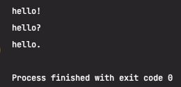

아래 코드로 텍스트 파일하나를 열어 보았습니다.

```python
text_file = open("my_text.txt")
my_text_file = text_file.read()
print(my_text_file)
```



하지만 이렇게 파일을 열게되면 꼭 close() 를 이용해서 닫아줘야 합니다. 그렇지 않으면 닫기 전까지 컴퓨팅 리소스를 계속해서 잡아 먹고있을  것 입니다.

하지만 with를 사용하게 된다면 더 이상 파일을 직접 끌 필요가 없어지며, 자동으로 파일을 관리해 줄 것입니다.

```python
with open("my_text.txt") as text_file:
    my_text_file = my_text.read()
    print(my_text_file)
```

with 아래의 문장들 indent 해주는 것은 잊지 말아야 합니다.

추가로 파일을 열고 수정도 할 수 있습니다.

```python
with open("my_text.txt", mode="a") as text_file:
    text_file.write("\nhello!!!!")
```

open에서 mode를 추가 해줌으로써 파일을 수정 할 수 있는데 a는 append로 수정한것을 붙이는 것입니다.
w를 하게되면 새로 입력하는 내용으로 덮어씌여지게 됩니다.
