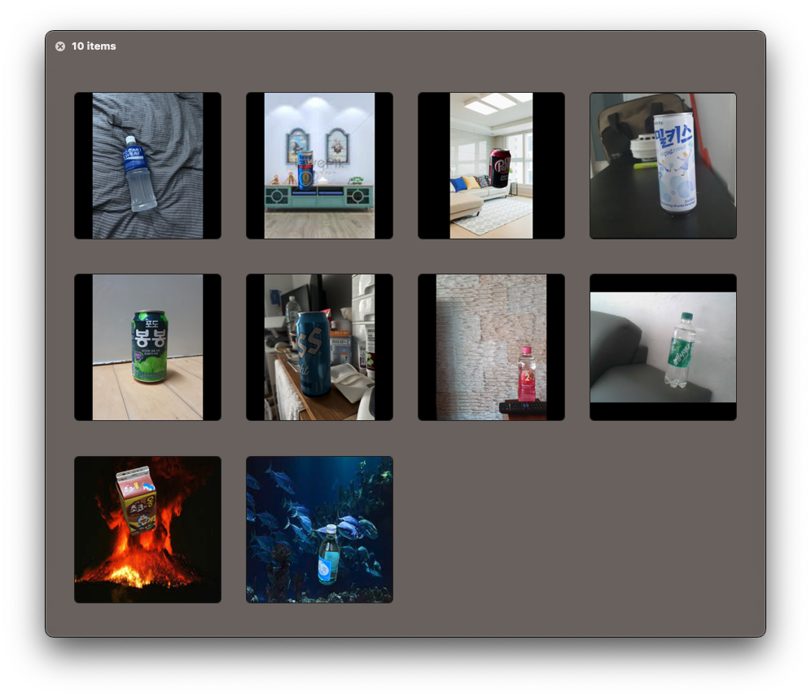

팀원들끼리 처음으로 같이 진행하는 프로젝트로 간단하게 진행할 수 있는 캔을 인식해서 어떤 음료인지 맞추는 프로젝트를 진행 하였습니다.

5명에서 진행하였고 인당 2개의 음료 데이터를 준비하였습니다.

부족하지만 각 라벨당 300개의 데이터를 목표로 잡았고 저 같은 경우에는 80장 정도씩 직접 찍고 나머지는 모두 배경을 합성하는 방법으로 진행 하였습니다. 나머지 인원들도 그렇게 진행 하였습니다.

데이터 수집하고 전처리 하는 과정에 걸림돌은 합성시에 직접찍은 사진과 합성한 사진의 사이즈가 틀려서 그냥 리사이즈를 실행시켰을 때
합성한 이미지들은 형태를 알아보기 힘들게 모양이 깨습니다. 그래서 방안으로 일부 패딩을 주고 모두 같은 사이즈로 리사이즈를 주니 해결이 되었습니다.

| Data set | Data set   | amout of Data |
| -------- | ---------- | ------------- |
|          | Train      | 2400          |
|          | Validation | 300           |
|          | Test       | 300           |
| total    |            | 3000          |

각자 모델은 원하는 것으로 선택하기로 하였고

저 같은 경우 DeIT를 선택하였습니다. 나머지 사항은 동일하게 맞추기로 하였고,

epoch = 25
batch = 128
lr = 0.001
로 통일시켰습니다.

저 같은 경우 test accurancy가 6%대로 처참하게 나타났습니다.
일전에 처음 DeIT를 사용할때 고양이 종 분류로 batch 340에 epoch를 100을 사용하였을때 50%대가 나왔던 것을 생각하면
모델이 매우 가볍고 1 epoch의 속도도 빨라 양으로 승부를 봐야하는 모델이 아닌가 생각을 하였습니다.

저희 팀원들의 최종 모델로는 ResNet_18을 선정하였습니다 Test시에 99.7%의 수치를 보여줬고 실제로 인식 시켰을 시에 준수한 성능을 보여주었습니다.

