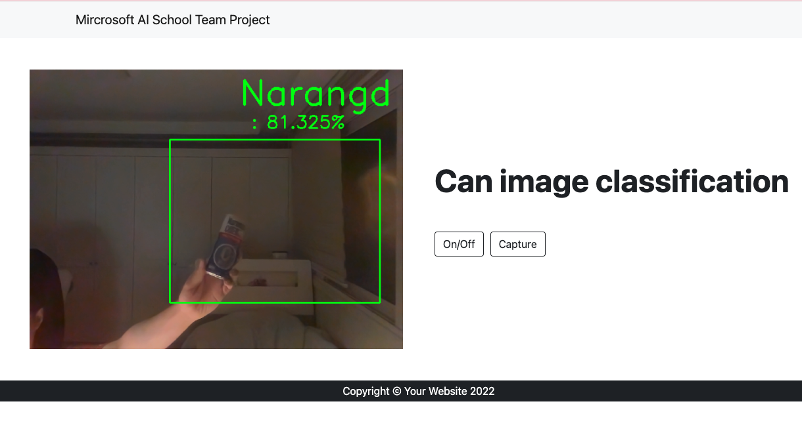

웹캠을 이용해서 학습시킨 캔을 분류하는 프로젝트를 진행하였었습니다.
이제 그것을 웹에서 실행 시킬수 있게 웹사이트에서 실행할 수 있도록 구현하였습니다.<br>
 <br>
먼저 학습 시킨 결과를 .pt파일로 저장해 놓았습니다.


FLASK를 위한 가상환경을 따로 구성하고 그 폴더에 학습파일과 .py를 같이 두었습니다.<br>
<br>
 
웹파이지는 직접 만들지않고, 부스트스트랩 테마에서 괜찮아 보이는 페이지를 가져와서 필요없는 부분을 다 덜어내였습니다.
 
```python
app = Flask(__name__, template_folder='./html', static_folder='./html/css')

@app.route('/')  # 127.0.0.1
def index():
    global push_btn
    global capture_btn
    return render_template('index.html', push_btn=push_btn, capture_btn=capture_btn)


# 웹캠 비디오를 로드한다.
@app.route('/video_screen')
def video_screen():
    return Response(generate_frames(), mimetype='multipart/x-mixed-replace; boundary=frame')


# on/off 버튼
@app.route('/push_switch')
def push_switch():
    global push_btn
    push_btn = not push_btn
    return redirect(url_for('index'))

# 캡쳐버튼
@app.route('/capture_switch')
def capture_switch():
    global capture_btn
    capture_btn = not capture_btn
    return redirect(url_for('index'))


if __name__ == '__main__':
    app.run(host="localhost", port=8000, debug=True)
```

app의 경로를 직접 html이 있는 폴더로 지정하였습니다.
app = Flask(__name__)로 하고 
template로 따로 경로를 지정하려고 하였으나 css를 읽어오는 과정에서 404error가 발생해서 조금 많이 해매었습니다.
템플릿 경로를 app=Flask에서 바로 지정해 주었더니 정상적으로 작동하였습니다.

```html
<div class="row py-20 gx-4 gx-lg-5 align-items-center">
    <div class="col-md-6">
        
    </div>
    <div class="col-md-6 py-20">
        <h1 class="display-5 fw-bolder ">
            Can image classification
        </h1>
        <a href="{{url_for('push_switch')}}">
            <input type="button" class="btn btn-outline-dark flex-shrink-0"  value="On/Off">
        </a>
        <a href="{{url_for('capture_switch')}}">
            <input type="button" id="button" class="btn btn-outline-dark flex-shrink-0 px-10" value="Capture" >
        </a>
    </div>
</div>
```

url_for를 파이썬에서 작성하고 html에서 버튼으로 지정해주면 똑같이 동작을 하게 됩니다.
 
마지막줄에 port:8000을 지정해주었습니다. 기본으로 5000번을 사용하는데 다른 앱들도 5000번을 사용하는 경우가 있는지 자주 실행이 정상적으로 안되는경우가 있어서 8000번을 지정하였습니다.
