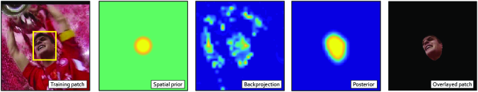

CSRT는 공간 신뢰도를 통한 구분상관 필터라는 뜻으로
다른 알고리즘 보다 느리지만 정확하다는 특징을 보여줍니다.

<small>https://www.arxiv-vanity.com/papers/1611.08461/</small>

첫 번째 박스에서 트래킹 하려는 객체를 선택합니다 여기서는 얼굴이 되겠습니다. 
그리고 선택된 박스로 학습을 시킵니다. 
 
그러면 구분 필터가 생성이 되고 HOG기법이 사용됩니다. 
HOG 기법은 이미지에서 중요한 정보는 두고 이외의 정보는 모두 버리게 됩니다. 
HOG는 코너와 엣지를 인식하게 되는데 사람의 얼굴모양처럼 원형의 모양을 인식하게 됩니다. 
 
이미지 예측을 위해 랜덤 마르코프 테스트를 적용하게 됩니다. 
원본 이미지의 형태와 유사하게 나타나는 것을 볼 수 있으며 이 단계에서 사람의 움직임을 나타내는 확률이 생성됩니다. 

컨피던스 맵을 생성하게 됩니다. 원본  이미지의 정보를 가린 마스크를 생성합니다. 
 
마지막으로 추적할 객체를 얻어 냅니다.

