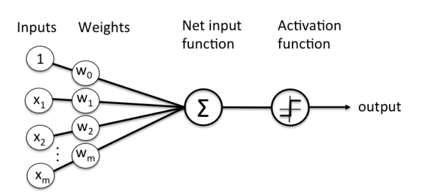

<small>http://bigdata.dongguk.ac.kr/lectures/datascience/_book/%EC%9D%B8%EA%B3%B5%EC%8B%A0%EA%B2%BD%EB%A7%9D.html
</small>

1, x1, x2... 은 input(입력값)이며 여러 데이터 정보를 얘기합니다. 
w0, w1, w2... 은 input 값에 대한 weight(가중치)입니다. 

Sum function을 계산합니다. 
x1 _ w1 + x2 _ w2... 

이것을 Activation function에 적용하고 Activation funcion은 뉴런의 작동여부를 알려줍니다. 

Activation함수를 Step function으로 적용시켰을 때 
Sumfunction에서 넘어온 값이 1과 같거나 클 때 1이 되며 뉴런이 활성화되었다는 뜻이고, 
그 외의 값은 0으로 나타내고 뉴런이 활성화되지 않았다는 말입니다. 

