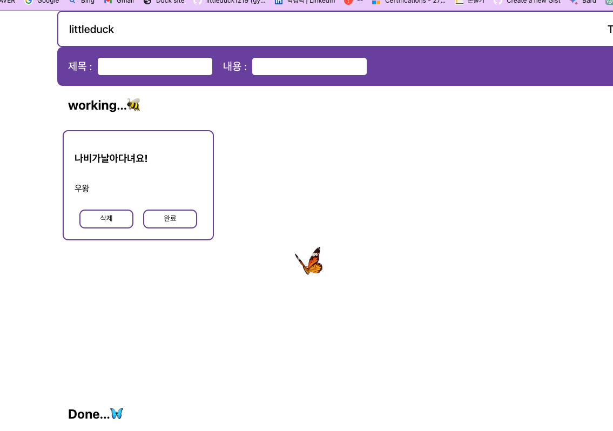

마우스의 좌표를 인식해서 마우스를 따라오는 나비가 나타나는 기능을 구현하였습니다.
하지만 마우스를 움직일 때마다 발생하는 렌더링 때문에 심하게 끊겼습니다.

```tsx
function Mousemover() {
	const [position, setPosition] = useState({ x: 0, y: 0 });
	const [target, setTarget] = useState({ x: 0, y: 0 });
	const speed = 0.08;

	const onMouseMove = (event) => {
		setPosition({ x: event.pageX, y: event.pageY });
	};
```

position에 현재 마우스 위치를 저장하고

target에 나비이미지의 위치를 저장합니다.

하지만 현재 마우스를 움직여 변수의 값이 변경되면 리렌더링이 되고 있습니다.


position과 target을 useRef로 감싸 줌으로써 이 변수들의 값이 변경되어도 컴포넌트가 리렌더링 되지 않게 하였습니다.


