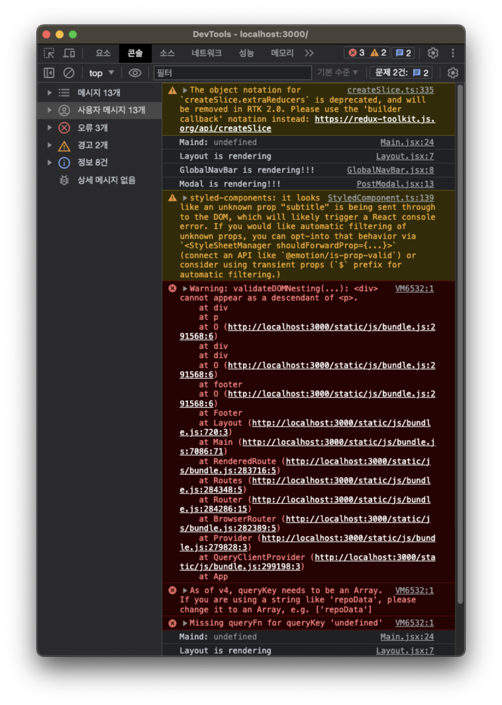

백엔드와 통신을 하여 드디어 목데이터를 없애고 서버데이터를 받아오는 작업을 진행하고 있었습니다.

react-query의 정식 명칭이 TanStack Query로 바뀐걸로 알고 있었는데 react-query가 작동하지만 그래도 정식을 써보자 해서 TanStack Query를 사용하게 되었습니다. 이름만 바뀌었을 뿐 사용법은 똑같은데 이상한 에러가 발생했습니다.

읽어보니 query key를 배열로 줘야 한다고 합니다.

```tsx
// 변경전
const { isLoading, isError, data, refetch } = useQuery('photo', getPhotoLists);

// 변경후
const { isLoading, isError, data, refetch } = useQuery(
  ['photo'],
  getPhotoLists,
);
```

잘 되는 것을 확인 했습니다.