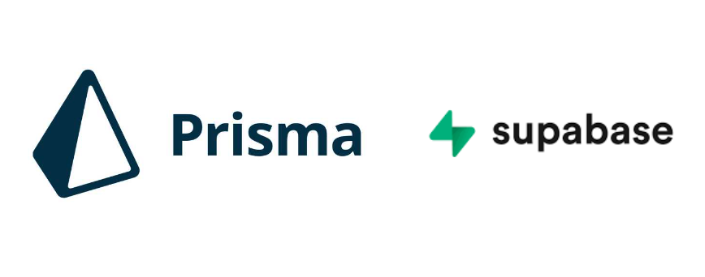

Prisma는 Node.js, Typescript 애플리케이션을 위한 오픈 소스 데이터베이스 ORM입니다. 데이터 베이스 스키마를 정의하고, 데이터베이스 마이그레이션을 수행하여 쿼리를 작성하고 실행하는데 도움을 줍니다.
`ORM(Object-relational-mapping)`은 DB를 객체로 매핑하여 자동으로 SQL을 생성해 주는 도구입니다. 최근에는 NoSQL 데이터베이스도 지원하기 시작하였습니다.

`Superbase`는 백엔드 서버를 간단하게 구축하여 PostgreSQL을 기반으로 SQL쿼리 및 다양한 데이터베이스 업무를 수행할 수 있습니다.
보통 Firebase대안으로 애기하며 Firebase는 훨씬 쉽고 편리하게 기능을 구현할 수 있다면 `superbase`는 조금 복잡하더라도 상세하고 많은 기능을 구현할 수 있습니다.

## 1. 시작하기

- Doc을 참고하였습니다.
  https://www.prisma.io/docs/getting-started/quickstart

**설치**

```bash
yarn add --dev prisma
```


**prisma 세팅**

```bash
npx prisma init
```


prisma schema가 생성되고 next steps에 보면 .env파일에 DATABASE_URL을 설정해라고 지시합니다.


프로젝트 폴더에서 prisma폴더가 생성된 것을 확인할 수 있으며 .env에도 보면 자동으로 어느 정도 설정해 준 것을 볼 수 있습니다.

연결해줄 DATABASE_URL은 superbase에서 가져오도록 하겠습니다.

superbase를 가입하고 new project를 눌러 프로젝트를 생성해 줍니다.


세팅에서 URL을 복사해서 .env에 붙여주겠습니다.


그리고 YOUR-PASSWORD에 붙여주도록 하겠습니다.


이어서 prisma client를 추가하도록 하겠습니다.


후에 prisma studio가 잘되는지 확인해 보겠습니다.


```bash
npx prisma studio
```

명령어를 입력하면 터미널에서 진행되고 locallhost:5555로 `studio`가 뜨는것을 볼 수 있습니다. error는 데이터베이스가 없어서 뜨는것이기 때문에 문제되지 않습니다.

이렇게 초기세팅은 완료되었습니다.


