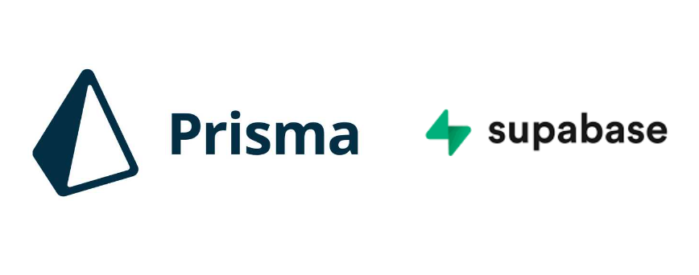

초기 데이터나 테스트를 생성하고 채우는 과정인 Seed를 진행해 보겠습니다.<br>
Doc : https://www.prisma.io/docs/guides/migrate/seed-database#how-to-seed-your-database-in-prisma

**Prisma Migration**
채울 값들을 정해줍니다.

```sql
model User {
  id    Int    @id @default(autoincrement())
  email String @unique
  name  String
  posts Post[]
}

model Post {
  id        Int     @id @default(autoincrement())
  title     String
  content   String
  published Boolean
  user      User    @relation(fields: [userId], references: [id])
  userId    Int
}
```

autoincrement를 사용하면 자동으로 id값을 증가시켜 줍니다
unique를 사용하면 겹치지않는 값을 줍니다

입력할 값을 정해준후 아래 명령을 꼭 진행시켜줘야 합니다.


```bash
npx prisma migrate dev --name init
```

**Prisma Seed**
package.json에 seed 스크립트 추가

```bash
yarn add -dev ts -node
```

아래 내용을 pakage.json에 입력해 줍니다.

prima/seed.ts 경로로 seed.ts를 만들어줍니다.

```tsx
"prisma": {
  "seed": "ts-node --compiler-options {\"module\":\"CommonJS\"} prisma/seed.ts"
},
```

Prisma 폴더에 seed.ts 파일 생성 후 seed 코드 작성

```tsx
import { parseArgs } from 'node:util';

const options = {
  environment: { type: 'string' },
};

async function main() {
  const {
    values: { environment },
  } = parseArgs({ options });

  switch (environment) {
    case 'development':
      /** data for your development */
      break;
    case 'test':
      /** data for your test environment */
      break;
    default:
      break;
  }
}

main()
  .then(async () => {
    await prisma.$disconnect();
  })
  .catch(async e => {
    console.error(e);
    await prisma.$disconnect();
    process.exit(1);
  });
```

이 과정에서 json데이터를 매핑하여 데이터를 정제하여 추가합니다.

```tsx
const user = await prisma.user.create({
  data: {
    email: 'ariadne@prisma.io',
    name: 'Ariadne',
    posts: {
      create: [
        {
          title: 'My first day at Prisma',
          categories: {
            create: {
              name: 'Office',
            },
          },
        },
        {
          title: 'How to connect to a SQLite database',
          categories: {
            create: [{ name: 'Databases' }, { name: 'Tutorials' }],
          },
        },
      ],
    },
  },
});
```

Doc : https://www.prisma.io/docs/guides/migrate/seed-database#seeding-your-database-via-any-language-with-a-bash-script

프리즈마를 시작하기 위해서 아래 코드를 입력하여 실행합니다.

```bash
npx prisma db seed
```


database seed migration에 성공한 모습입니다.
