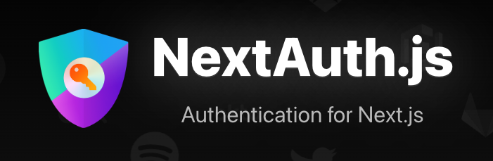

Next Auth를 통해 로그인이 필요한 페이지는 어떻게 구현하는지 궁금했는데 그것에 대해서 알아보았습니다.

위 이미지 처럼 folder에 middleware.ts파일을 만들어 로그인이 필요한 페이지 url을 정의합니다.

위 이미지 처럼 pages/api/auth라는 폴더에 [...nextauth].ts라는 파일에 내용의 정의하면 사용자 인증이 필요한 경로가 설정됩니다.

localhost:3000/users/likes에 접속하면 이렇게 자동으로 
http://localhost:3000/api/auth/signin?callbackUrl=%2Fusers%2Flikes 인증이 필요한 callback페이지로 설정이됩니다.

위처럼 @/pages/api/auth/ 경로에 [...nextauth].ts 파일을 만들고 provider를 설정하면 위 브라우저 이미지 처럼 설정한 provider를 사용할 수 있습니다. 현제는 구글을 설정했기때문에 구글이 나타납니다.
