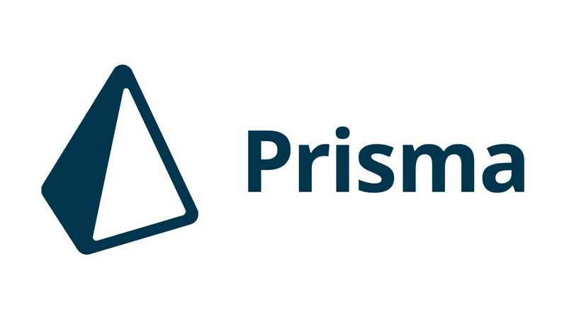

**Prisma란**

Prisma는 개발자들이 데이터베이스와 상호작용할 수 있게 해주는 오픈소스 데이터베이스 툴킷입니다. TypeScript, JavaScript, Go 등 다양한 언어를 지원하며, 특히 Node.js 및 TypeScript 환경에서 백엔드 개발을 할 때 많이 사용됩니다. Prisma를 사용하는 주된 이유는 데이터베이스 스키마 관리, 쿼리 구성, 마이그레이션 관리 등 데이터베이스 작업을 보다 쉽고 효율적으로 만들기 위함입니다.

**prisma 구성요소**

1. Prisma Client: 애플리케이션 코드에서 데이터베이스에 접근할 때 사용하는 자동 생성된 쿼리 빌더입니다.Prisma Client는 타입 안전성을 제공하여, 개발 시 발생할 수 있는 많은 오류를 사전에 방지해 줍니다.
2. Prisma Migrate: 데이터베이스 스키마 변경 사항을 추적하고 버전 관리하는 도구입니다. 개발자가 모델의 변경사항을 스키마 파일에 정의하면, Prisma Migrate는 이 변경사항을 기반으로 데이터베이스 마이그레이션 파일을 생성하고 적용합니다.
3. Prisma Studio: 데이터베이스의 데이터를 시각적으로 관리할 수 있는 GUI 툴입니다. 개발자가 데이터베이스에 저장된 데이터를 조회, 추가, 수정, 삭제하는 작업을 손쉽게 할 수 있도록 지원합니다.

<br>

prisma를 먼저 설치 해줍니다.

```bash
npm install prisma
```

prisma schema를 생성합니다.

```bash
npx prisma init
```

init 명령어를 실행하면 자동으로 .env파일에 환경변수가 정의되며
아래와 같이 간단하게 타입을 정의하는 것으로 스키마를 정의할 수 있습니다.
현재 앱은 todo앱으로 id, title, description, status, created_at, updated_at을 정의 해주었습니다.

```tsx
generator client {
  provider = "prisma-client-js"
}

datasource db {
  provider = "postgresql"
  url      = env("DATABASE_URL")
}

model Issue {
  id          Int       @id @default(autoincrement())
  title       String    @db.VarChar(255)
  description String    @db.VarChar(255)
  status      Status    @default(OPEN)
  createdAt   DateTime  @default(now())
  updatedAt   DateTime  @updatedAt
}

enum Status {
  OPEN
  IN_PROGRESS
  DONE
}
```

이 모델을 마이그래이션 합니다.

```bash
npx prisma format

npx prisma migrate dev
```
