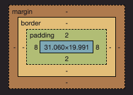

마진(Margin)과 패딩(Padding)은 CSS에서 박스 모델(Box Model)을 구성하는 중요한 속성들입니다. 이들은 요소의 레이아웃을 조정하고 공간을 만드는 데 사용됩니다.

## 마진(Margin)

- 마진은 요소의 외부 공간을 나타냅니다. 요소와 주변 요소 사이의 공간을 지정합니다.
- 마진은 양수, 음수, 또는 제로 값을 가질 수 있으며, 음수 값은 요소를 다른 요소와 겹치게 만들 수 있습니다.
- 마진은 쌓임(collapsing) 현상이 발생할 수 있습니다. 이는 상위 요소의 마진과 하위 요소의 마진이 충돌하여 하나의 마진으로 결합되는 현상을 의미합니다.

## 패딩(Padding)

- 패딩은 요소의 내부 공간을 나타냅니다. 요소의 내용(content)과 테두리(border) 사이의 공간을 지정합니다.
- 패딩은 양수 값을 가질 수 있으며, 음수 값은 허용되지 않습니다.
- 패딩은 요소의 크기를 변경하지 않으며, 요소의 내용이나 테두리가 있는 영역을 제어합니다.

### 차이점:

- 영향 범위:

  1. 마진은 요소와 주변 요소 사이의 공간을 조정하고, 레이아웃에 영향을 미칩니다.
  2. 패딩은 요소의 내부 공간을 조정하고, 요소의 내용의 위치 및 테두리와의 관계를 설정합니다.

- 쌓임 현상:

  1. 마진은 쌓임 현상이 발생할 수 있어, 인접한 요소의 마진이 합쳐질 수 있습니다.
  2. 패딩은 쌓임 현상이 없으며, 요소의 내부 공간만을 설정합니다.

- 적용 대상:

  1. 마진은 요소의 바깥쪽 공간을 조절하며, 상하좌우 모두에 적용됩니다.
  2. 패딩은 요소의 내부 공간을 조절하며, 상하좌우 모두에 적용됩니다.
