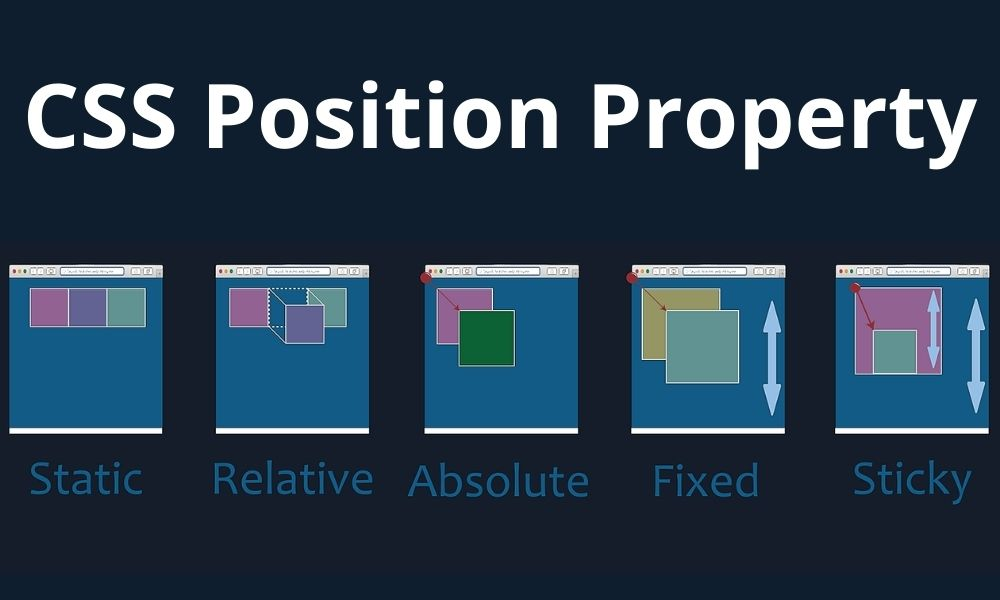

CSS의 position 속성은 요소의 위치를 지정에 사용합니다.

- **static** : 요소가 일반적인 문서 흐름에 따라 배치되는 기본값으로 생략이 가능하며 top, left와 같은 위치 지정 속성을 무시합니다.
- **relative** : 요소를 원래 위치를 기준으로 상대적으로 배치합니다. 다른 요소들은 영향을 받지않으며 원래 위치를 유지합니다.
- **absolute** : 요소를 부모를 기준으로 상대적으로 배치합니다. 부모가 없다면 body를 기준으로 하게 됩니다.
- **fixed** : 요소를 뷰포트 기준으로 배치하게되며 스크롤이 되어도 요소는 화면에 고정됩니다.
- **sticky** : 요소는 일반적으로 static 상태에 머물지만 스크롤이 발생하게 되면 문서의 흐름에 따라서 배치됩니다.
