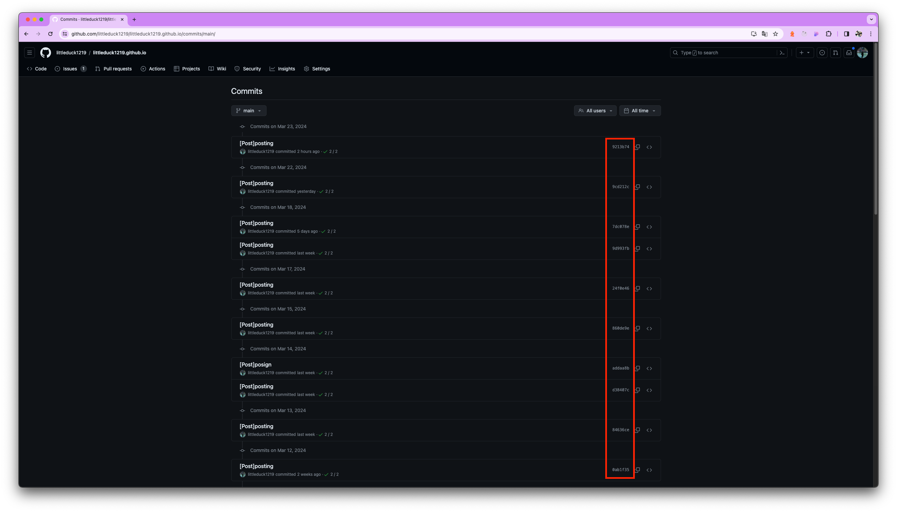

최근 commit의 내용이 오류가 많은 것을 확인했고 고치기에는 너무 오랜 시간이 걸릴 것 같았습니다.
그래서 GitHub의 commit 기록을 되돌리기로 했습니다.

1. 원하는 이전 커밋으로 되돌아갑니다. 이전 커밋의 해시 또는 커밋 메시지를 사용하여 하드 리셋을 수행합니다.

    ```bash
    git reset --hard <이전 커밋 해시 또는 커밋 메시지>
    ```

    

    빨간색으로 내모 친 부분이 commit의 Hash입니다.

2. 이전 커밋 상태로 되돌아간 후에는 이를 원격 저장소에 강제로 푸시합니다.

    ```bash
    git push origin main --force
    ```

    이걸로 commit 되돌리기 완료 입니다.
