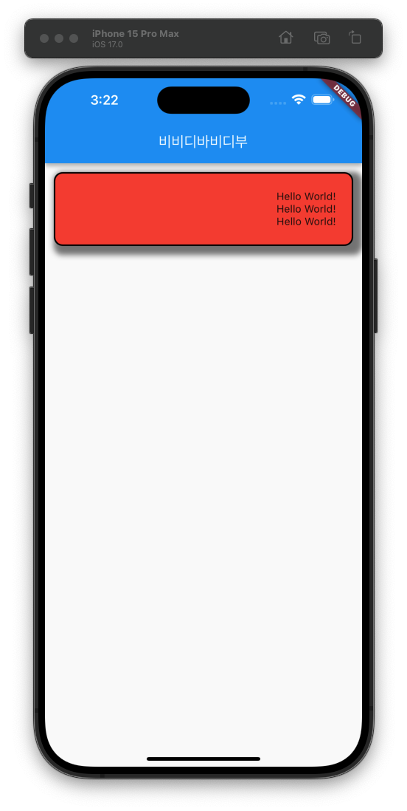

Flutter의 기초에 대해 학습하였습니다.



```dart
import 'package:flutter/material.dart';

void main() {
  runApp(MaterialApp( // 플루터 최상위 위젯으로 앱의 테마 및 라우팅을 결정합니다.
    home: Scaffold( // 앱의 기본 레이아웃 구조 위젯으로 앱의 화면을 정의 합니다.
      appBar: AppBar( // 앱의 상단 헤더 위젯 입니다.
        title: const Text('비비디바비디부'), // 헤더의 텍스트
      ),
      body: const CustomContainer(), // 앱의 바디 부분입니다. 직접 여기에 정의 할 수 있지만 따로 함수를 빼내었습니다.
    ),
  ));
}

class CustomContainer extends StatelessWidget { // Container로 웹의 div태그와 비슷한 역활입니다. Stateless 속성을 가지고 있기때문에 상태가 변경되지 않습니다.
  const CustomContainer({super.key});


  @override
  Widget build(BuildContext context) {
    return Container(
      width: double.infinity, // 컨테이너 넓이
      height: 100, // 컨테이너 높이
      // color: Colors.red, 색상 : decoration을 선언할 경우 decoration 내부에 선언 해야 합니다.
      // color: Color(0xFF00FF00), 색상(헥사코드)
      padding: const EdgeInsets.fromLTRB(300, 12, 10, 12), // 패딩
      margin: const EdgeInsets.symmetric(vertical: 12, horizontal: 12), // 마진
      decoration: BoxDecoration( // 컨테이너 스타일
        color: Colors.red, // 색상
        border: Border.all( // border
          color: Colors.black, // border 색상
          width: 2, // border 굴기
        ),
        borderRadius: BorderRadius.circular(12), // border 곡률
        boxShadow: [ // 그림자
          BoxShadow(
              color: Colors.black.withOpacity(0.5), // 그림자 색상, 명도?
              offset: const Offset(6, 6), // 그림자 간격
              blurRadius: 6, // 그림자 곡률
              spreadRadius: 6, // 그림자 퍼짐
              blurStyle: BlurStyle.normal // 그림자 퍼짐 스타일
            ),
        ]
      ),
      child: const Center(child: Text('Hello World! Hello World! Hello World!')), // 컨테이너 내부 텍스트
    );
  }
}
```

