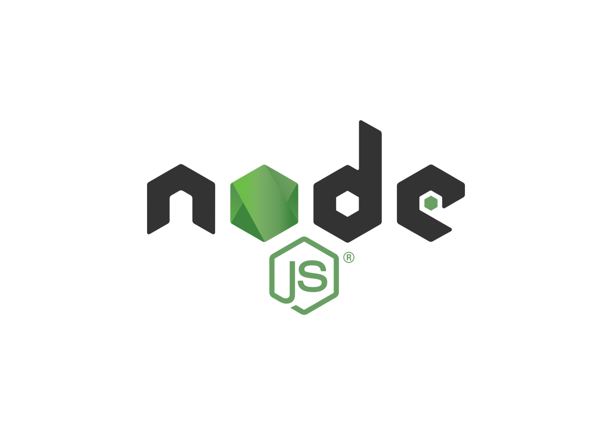

# Node란 무엇인가?

흔히 Node가 뭐냐고 물으면 "JavaScript로 만들 수 있는 서버" 라고 말을합니다. 하지만 그것은 틀린말입니다.
JavaScript는 Node의 등장으로 거의 HTML에 종속적이던 상황을 벗어나 자체적으로 실행할 수 있게 되었습니다.
그로써 JavaScript 로 서버 코드를 작성하여 서버를 실행 할 수 있게 된 것입니다. Node가 무엇인지 묻는다면 "JavaScript 런타입 환경으로 JavaScript를 실행 시킬 수 있도록 합니다." 라고 대답해야 합니다.

# Node backend

Node.js가 등장하면서 JavaScript는 브라우저 환경에서만 작동하는 것이 아니라 서버 측에서도 사용할 수 있게 되었습니다. 이것은 개발자들이 클라이언트와 서버 모두에서 동일한 언어를 사용하여 작업할 수 있도록 함으로써 개발 생산성을 향상시켰습니다.

Node.js를 사용하여 백엔드를 구현할 때, 일반적으로 다음과 같은 기능을 수행합니다:

1. **서버 생성**: Node.js를 사용하여 HTTP 또는 HTTPS 서버를 만들 수 있습니다. 이 서버는 클라이언트의 요청에 응답하고, 데이터를 반환하거나 저장할 수 있습니다.

2. **라우팅**: 요청된 URL 경로에 따라 적절한 핸들러 함수로 요청을 라우팅합니다. 이를 통해 서버는 요청된 리소스에 대해 적절한 처리를 수행할 수 있습니다.

3. **비즈니스 로직 처리**: 클라이언트의 요청에 따라 데이터베이스와 통신하거나 다양한 연산을 수행하여 비즈니스 로직을 처리합니다.

4. **데이터베이스 연동**: Node.js는 다양한 데이터베이스와의 통합을 지원합니다. MongoDB, MySQL, PostgreSQL 등 다양한 데이터베이스와 연동하여 데이터를 읽고 쓸 수 있습니다.

5. **인증 및 보안**: 사용자 인증, 세션 관리, 데이터 검증 등과 같은 보안 관련 기능을 구현하여 시스템을 보호할 수 있습니다.

6. **API 제공**: RESTful API 또는 GraphQL을 사용하여 클라이언트 애플리케이션과 통신할 수 있는 API를 제공할 수 있습니다.

7. **에러 처리**: 예외와 에러를 적절하게 처리하여 안정적이고 신뢰성 있는 서비스를 제공합니다.

