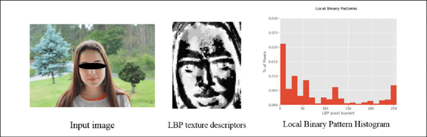
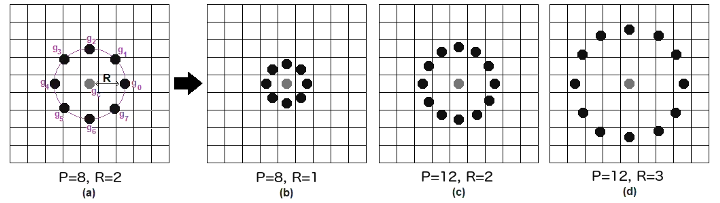

## mini project:YOLOv7 animal detect

 

LBPH알고리즘은  이미지를 정사각형 단위로 나누고,
선택된 픽셀의 중앙값을 기준으로 조건을 적용하여,
중앙값보다 크면 1, 작으면 0으로 치환합니다.

 

17&nbsp;&nbsp;
20&nbsp;&nbsp;
29&nbsp;&nbsp;

6&nbsp;&nbsp;
16&nbsp;&nbsp;
3&nbsp;&nbsp;

1&nbsp;&nbsp;
18&nbsp;&nbsp;
6&nbsp;&nbsp;

 

if >= 16 ---> 1

 

if < 16 ---> 0

 

1&nbsp;&nbsp;
1&nbsp;&nbsp;
1&nbsp;&nbsp;

 

0&nbsp;&nbsp;
16&nbsp;&nbsp;
0&nbsp;&nbsp;

 

0&nbsp;&nbsp;
1&nbsp;&nbsp;
0&nbsp;&nbsp;

 

Binary = 11100100
 
Deciaml = 228

 

LBPH는 조명을 다룰 때 효과적인데
이미지에 조명을 비추게 되면 픽셀값이 증가하게 됩니다.
조명을 비추었을 때 다음과 같이 픽셀 값을 가졌을 때 위와 같은 과정을 거치는 것을 계산해 보겠습니다.

 

47&nbsp;&nbsp;
50&nbsp;&nbsp;
59&nbsp;&nbsp;

 

36&nbsp;&nbsp;
46&nbsp;&nbsp;
33&nbsp;&nbsp;

 

31&nbsp;&nbsp;
48&nbsp;&nbsp;
36&nbsp;&nbsp;

 

Binary = 11100100
 
Deciaml = 228

 

조명을 비추지 않았을 때와 같은 값을 가지게 되는 것을 확인할 수 있습니다.

 

다음 단계로 히스토그램을 생성하게 되는데,
각각의 색이 정사각형에 몇 번이나 나타나는지 수를 세게 됩니다.

 

히스토그램에 따라서 이미지의 에지 부분과 코너를 식별하게 됩니다.

 

 

LBPH 알고리즘에는 몇 가지 매개변수가 존재하는데 매개변수를 사용함으로써 결과를 더 좋게 나타낼 수 있습니다.

 

1. Radius(반지름)  
   Radius는 이진값을 생성하기 위한 중앙 픽셀 주변의 반경을 나타내는 값으로 default값으로 1이 설정되어있습니다.
   값을 늘리면 이미지의 얇은 부분 모서리를 찾기 어려워할 수 있지만 이미지에서 많은 패턴을 찾을 수 있습니다.
   변수의 값을 늘리면 반경은 늘어나며 동시에 처리하는 속도도 느려지게 됩니다.

2. Neighbors(이웃 수)  
   이진 수를 구하기 위한 이웃한 픽셀의 수입니다. default값으로 8이 설정되어 있습니다.
   Radius와의 차이로 Radius는 범위를 설정하는 반면 Neighbors는 개수를 지정합니다.

3. grid_x, grid_y(가로축, 세로축)  
   가로축과 세로축의 개수로 셀이 많을수록 그리드가 미세해지고 히스토그램의 수가 많아지며 이미지에서 더 많은 패턴을 추출합니다.

4. Threshold(신뢰도)  
   값이 높을수록 얼굴 인식의 품질이 높아집니다.
